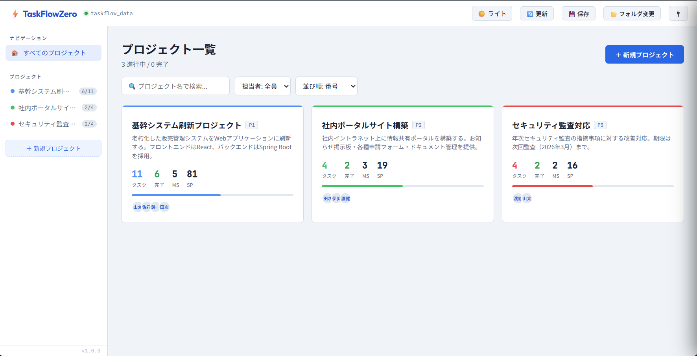
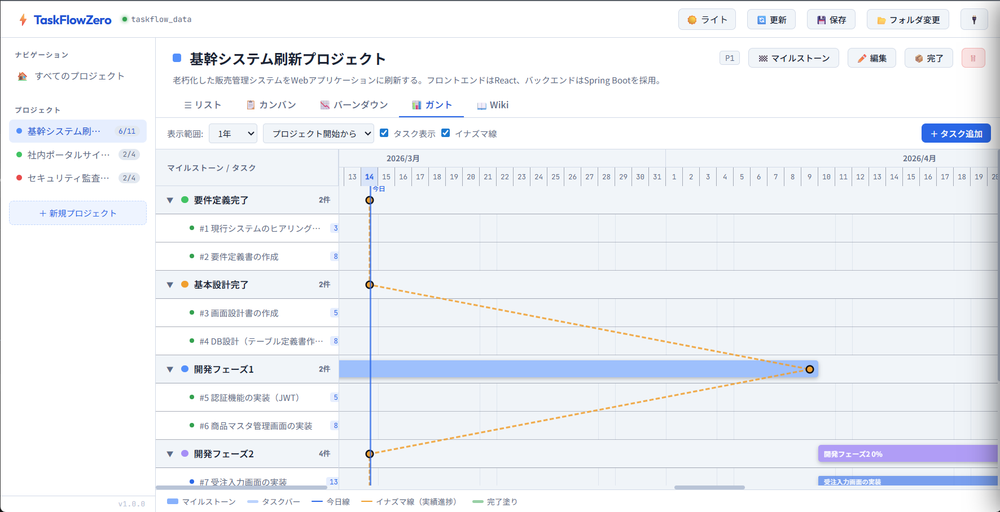
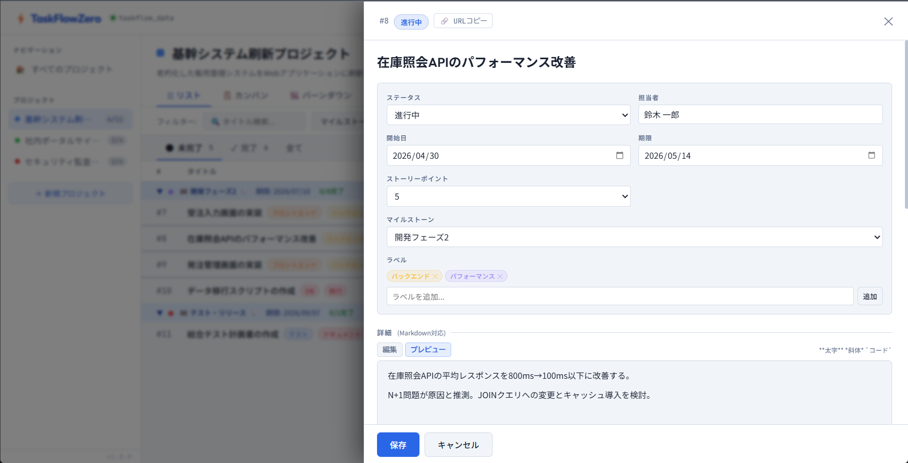
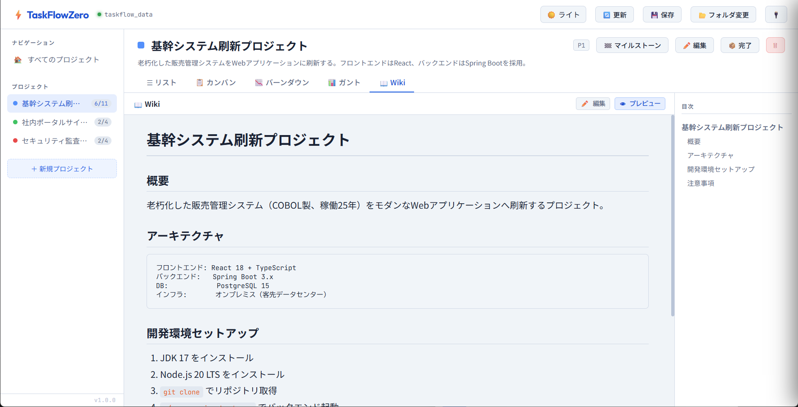

# ⚡ TaskFlowZero

**Single-file project management tool. No server. No installation. Your data stays where you put it.**

[](./LICENSE)
[](https://sasayan0825.github.io/TaskFlowZero/taskflowzero.html)
[](./taskflowzero.html)

🔗 **[Try it now →](https://sasayan0825.github.io/TaskFlowZero/taskflowzero.html)**

🇯🇵 [日本語版 README はこちら](./README.md)

---

## What is this?

Built for engineers who can't use cloud tools at work.

On-site at a client? Strict security policies? No internet access?  
Jira, Notion, and Asana all send your data to the cloud. TaskFlowZero doesn't.  
**Everything stays on your PC or your company's network. Always.**

One HTML file. That's it.

---

## Features

### 🔒 Your data never leaves
Files are stored locally or on your internal shared folder. Zero cloud communication. Works perfectly in air-gapped or restricted environments.

### 📦 Zero installation
Just open `taskflowzero.html` in Chrome or Edge. No IT requests. No setup. No admin rights needed.

### 👥 Share with your team
Select a shared folder and everyone can read and edit the same data. Conflicts from simultaneous edits are resolved automatically — or manually — with **3-way merge**.

### 📊 Five views, one tool

| View | Description |
|---|---|
| List | GitHub Issues-style, grouped by milestone |
| Kanban | Drag cards across status columns |
| Gantt | Drag bars to adjust dates, with progress lightning line |
| Burndown | Visualize sprint progress by story points |
| Wiki | Write specs and docs in Markdown |

---

## Getting Started

### Personal use (minimal setup)

Open `taskflowzero.html` in Chrome or Edge, then click **「📁 新規作成」** to select a folder.

```
any-folder/
├── taskflowzero.html    ← open this (can live outside the data folder)
└── project_P1.json      ← auto-created when you add a project
```

### Team sharing

Select a **shared folder** (OneDrive, NAS, file server, etc.) and everyone points to the same place.

```
shared-folder/  (OneDrive / NAS / file server)
├── project_P1.json      ← one file per project, auto-created
├── project_P2.json
└── project_P3.json      ← independent files = fewer conflicts
```

> Because each project lives in its own JSON file, **two people editing different projects at the same time will never conflict**. If they edit the same project simultaneously, 3-way merge handles it automatically or prompts for manual resolution.

### Fully offline (no CDN access)
Place these files alongside the HTML for complete offline operation:
```
any-folder/
├── taskflowzero.html
├── marked.min.js        ← Markdown rendering
└── chart.min.js         ← Burndown chart
```

> **Supported browsers:** Chrome / Edge (requires File System Access API)

---

## Screenshots

| | |
|---|---|
|  |  |
| Project List | Gantt Chart |
|  |  |
| Task Detail | Wiki |

---

## Plugins

Extend functionality by editing `plugin/plugins.js` — no changes to the main HTML required.

| Plugin | Description |
|---|---|
| `plugin_lang.js` | Switch UI language between Japanese and English |
| `plugin_csv_export.js` | Export task list to CSV |
| `plugin_overdue_badge.js` | Show overdue task count in the sidebar |
| `plugin_summary.js` | Add a Summary view tab to each project |

### Plugin Manager UI

Click the 🔌 button in the top-right header to manage plugins through a GUI — no need to edit `plugin/plugins.js` manually.

- **Install:** Drop a JS file onto the panel, or use the file picker
- **Reorder:** Drag and drop to change load order
- **Remove:** Remove from the list (the JS file itself is kept)

> **First time only:** Clicking 🔌 will prompt you to select the `plugin/` folder. It's remembered automatically after that.

See [PLUGIN_DEVELOPER_GUIDE.txt](plugin/PLUGIN_DEVELOPER_GUIDE.txt) to build your own plugins.

---

## Who is this for?

- 👨‍💻 Engineers and PMs working on-site at clients where cloud tools are blocked
- 🏭 Teams in environments where sending data outside the company is prohibited
- 🔧 Anyone still managing tasks in Excel who wants something a bit better
- 🧑‍🤝‍🧑 Small teams looking for a lightweight shared task tracker

---

## Why there's no login

TaskFlowZero has no login or authentication. This is intentional.

The main purpose of login in cloud services is to identify "whose data is this." Since TaskFlowZero stores everything on your own PC or internal network, access control is handled by your OS and network permissions — not the app itself.

Managing IDs and passwords inside the app would only add overhead and introduce new security risks. Keeping it simple — just open the folder and start working — is the point.

---

## Tech Stack

- **Frontend:** Vanilla HTML / CSS / JavaScript (no frameworks)
- **Storage:** File System Access API (folder selection) + IndexedDB (remembers last folder)
- **Data format:** One JSON file per project (`project_P1.json`, `project_P2.json` ...)
- **Markdown:** [marked.js](https://marked.js.org/)
- **Charts:** [Chart.js](https://www.chartjs.org/)
- **Dependencies:** Only the two above (CDN or local files)

---

## Built with Claude

This project was built together with **Claude**, an AI assistant by [Anthropic](https://www.anthropic.com/).

Design, implementation, debugging, docs — pretty much everything happened through conversation. "I want this feature." "This feels off." That back-and-forth is how TaskFlowZero came to be.

> *Built in collaboration with [Claude](https://claude.ai/) by Anthropic.*

---

## License

[MIT License + Commons Clause](./LICENSE)

- ✅ Personal and team use — free
- ✅ Deployment on internal networks — free
- ✅ Modification and customization — free
- ❌ Selling or bundling into a paid service — requires permission

For commercial licensing inquiries, please open an [Issue](https://github.com/sasayan0825/TaskFlowZero/issues).

---

<div align="center">
  <sub>Made with ⚡ for engineers working on-site</sub>
</div>
